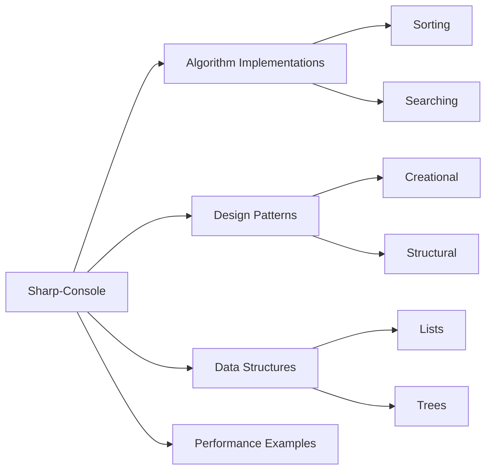
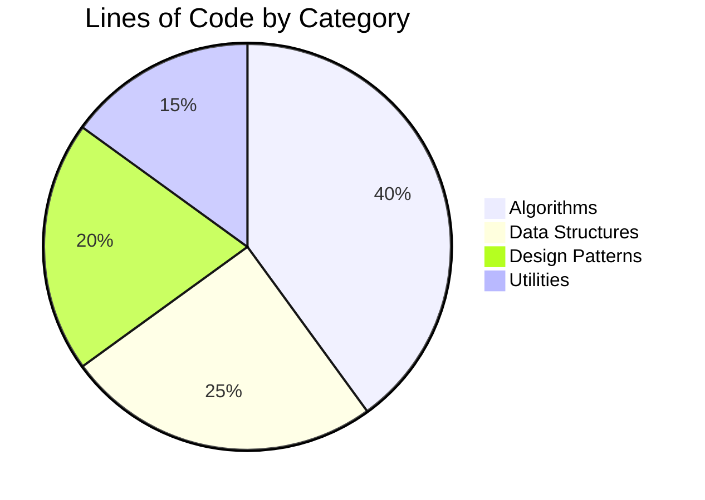

# 🎯 Sharp-Console

<div align="center">

[](https://opensource.org/licenses/MIT)
[](https://docs.microsoft.com/en-us/dotnet/csharp/)
[](https://dotnet.microsoft.com/)
[](https://visitorbadge.io)


### 🚀 A Collection of C# Console Applications for Experimentation and Learning

[View Demo](https://your-demo-link.com) · [Report Bug](https://github.com/yourusername/Sharp-Console/issues) · [Request Feature](https://github.com/yourusername/Sharp-Console/issues)

</div>

## 📋 Table of Contents

- [About](#-about)
- [Features](#-features)
- [Tech Stack](#-tech-stack)
- [Getting Started](#-getting-started)
- [Project Structure](#-project-structure)
- [Usage Examples](#-usage-examples)
- [Performance Metrics](#-performance-metrics)
- [Contributing](#-contributing)
- [License](#-license)
- [Contact](#-contact)

## 🎯 About

Sharp-Console is a curated collection of C# console applications designed for experimentation, learning, and showcasing various programming concepts. From basic algorithms to advanced design patterns, each application demonstrates different aspects of C# programming.

## ✨ Features



## 🛠 Tech Stack

<div align="center">


</div>

## 🚀 Getting Started

1. **Clone the repository**
```bash
git clone https://github.com/yourusername/Sharp-Console.git
```

2. **Navigate to the project directory**
```bash
cd Sharp-Console
```

3. **Build the solution**
```bash
dotnet build
```

4. **Run any example**
```bash
dotnet run --project src/ExampleName
```

## 📁 Project Structure

```
Sharp-Console/
├── src/
│   ├── Algorithms/
│   ├── DataStructures/
│   ├── DesignPatterns/
│   └── PerformanceTests/
├── tests/
├── docs/
└── examples/
```

## 💻 Usage Examples

### Basic Console Application
```csharp
public class Program
{
    public static void Main(string[] args)
    {
        Console.WriteLine("Welcome to Sharp-Console!");
        
        // Example of a simple algorithm
        var numbers = new[] { 64, 34, 25, 12, 22, 11, 90 };
        BubbleSort(numbers);
        
        Console.WriteLine("Sorted array:");
        Console.WriteLine(string.Join(", ", numbers));
    }

    private static void BubbleSort(int[] arr)
    {
        int n = arr.Length;
        for (int i = 0; i < n - 1; i++)
            for (int j = 0; j < n - i - 1; j++)
                if (arr[j] > arr[j + 1])
                {
                    int temp = arr[j];
                    arr[j] = arr[j + 1];
                    arr[j + 1] = temp;
                }
    }
}
```

## 📊 Performance Metrics

### Algorithm Performance Comparison

```mermaid
gantt
    title Algorithm Execution Time Comparison
    dateFormat X
    axisFormat %s

    section Bubble Sort
    Small Dataset      :0, 2
    Medium Dataset     :0, 5
    Large Dataset      :0, 10

    section Quick Sort
    Small Dataset      :0, 1
    Medium Dataset     :0, 2
    Large Dataset      :0, 4

    section Merge Sort
    Small Dataset      :0, 1
    Medium Dataset     :0, 3
    Large Dataset      :0, 5
```



## 🌟 Project Statistics

### Code Distribution



## 🤝 Contributing

Contributions are what make the open source community such an amazing place to learn, inspire, and create. Any contributions you make are **greatly appreciated**.

1. Fork the Project
2. Create your Feature Branch (`git checkout -b feature/AmazingFeature`)
3. Commit your Changes (`git commit -m 'Add some AmazingFeature'`)
4. Push to the Branch (`git push origin feature/AmazingFeature`)
5. Open a Pull Request

## 📝 License

Distributed under the MIT License. See `LICENSE` for more information.

[Previous content remains the same until the Contact section...]

## 📫 Contact

Ailyn Diaz

[](https://linkedin.com/in/ailyndiaz01)
[](https://ailynux.github.io/)
[](https://github.com/ailynux)

---

<div align="center">

### ⭐ Star this repo if you found it helpful!

</div>


